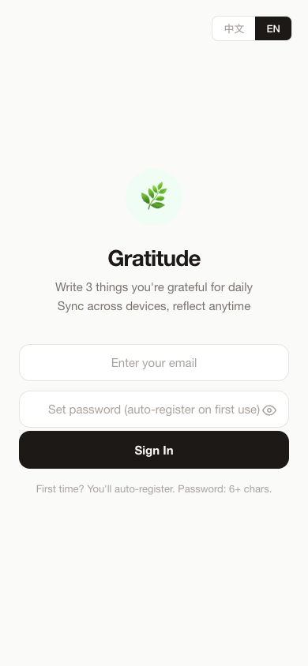
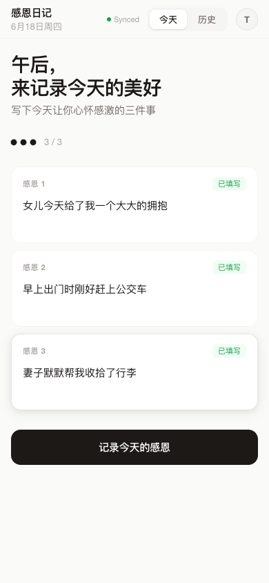
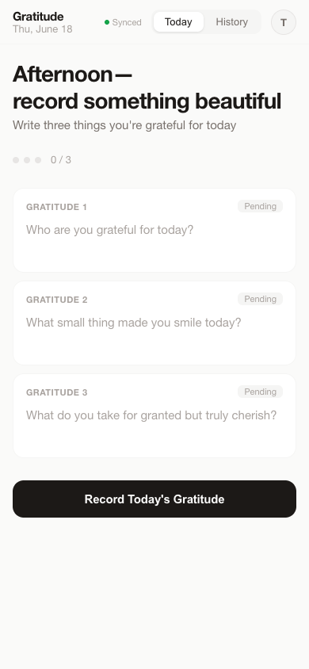
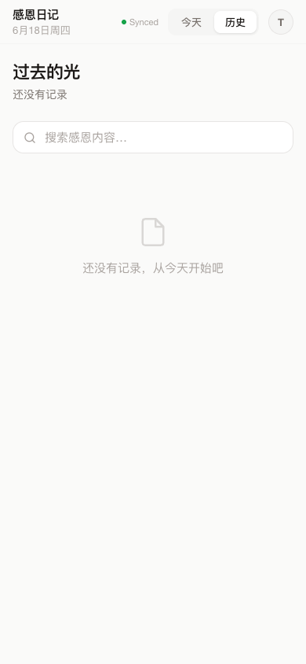

# 🌿 留住这束光 · Gratitude Journal

**A gratitude app that doesn't guilt you into writing. It just waits for the light.**

[**Try V1 →**](https://davidma1973simu.github.io/gratitude-app/) &nbsp;·&nbsp; [**Try V2 →**](https://davidma1973simu.github.io/gratitude-app/v2/)

---

## The problem with gratitude apps

They treat gratitude like homework. Streaks, badges, push notifications, "Don't break the chain!" — and when you miss a day, you feel worse than before.

**Gratitude isn't a task. It's a frequency.**

When you pause to notice something good — sunlight on a wall, a friend's message, a quiet morning — you're tuning yourself to a different frequency. Over time, the fog clears, your mood steadies, and something shifts. Not magic. Just: where attention goes, energy flows.

This app is built on one principle:

> **No guilt. No catch-up. Today is always a new day.**

---

## Two versions, one philosophy

### V1 — The Quiet Room

The essential gratitude practice. Nothing extra.

- **Write 1–3 things** — One sentence is enough. No pressure to fill all three.
- **Auto-save drafts** — Come back anytime.
- **Cross-device sync** — Log in once, your entries follow you.
- **Past Light** — Browse and search all past entries.
- **Bilingual** — 中文 / English toggle on login.
- **PWA** — Install on home screen. Works like a native app.
- **Midnight nudge** — A gentle reminder at 11 PM, nothing more.

[Try V1 →](https://davidma1973simu.github.io/gratitude-app/)

### V2 — The Light Comes Back

Everything in V1, plus emotional layers that deepen over time.

- **📸 Polaroid card** — Your gratitude becomes a beautiful photo card. Random scene background, your words rendered in elegant light typography. Save it. Share it.
- **🌌 Reunion** — A full-screen immersive moment with one past gratitude. Not a list — a reunion.
- **🌿 Whisper encouragement** — Milestone hints appear as quiet green text: first entry, second entry, 3-day streak, 7 entries, 20 entries. No badges. No celebration. Just a whisper.
- **✨ Greeting** — *「感谢今天的，照到我身上的光」* — a single line that changes how you enter the app.
- **💧 Watermark** — A faint echo of a past gratitude on the home page. Subtle. Poetic.

[Try V2 →](https://davidma1973simu.github.io/gratitude-app/v2/)

Both versions share the same backend — your data is identical in both.

---

## Screenshots

<p align="center">
  
  
</p>
<p align="center">🔐 Email + password · 中文 / EN toggle</p>

<p align="center">
  
  
</p>
<p align="center">✍️ Write gratitudes · Auto-save · Polaroid card (V2)</p>

<p align="center">
  
</p>
<p align="center">📖 Past Light — browse and search your entries</p>

---

## Design philosophy

| | |
|---|---|
| **No guilt** | Missed a day? No problem. No streaks, no badges, no "you're on a 3-day streak!" |
| **No noise** | No ads, no analytics, no tracking. Your data is yours. |
| **No CDN** | Zero external dependencies. One HTML file. Works in China. Works offline. |
| **Whisper, not shout** | Encouragement is faint green text, not confetti. The app respects silence. |
| **Habit → Identity** | Not "did you write today?" but "you are someone who notices the light." |

---

## Roadmap

| Version | Status | Focus |
|---------|--------|-------|
| **V1** | ✅ Stable | Core practice — write, save, revisit |
| **V2** | 🧪 Beta | Emotional depth — Polaroid card, Reunion, whisper encouragement |
| **V3** | 🔮 Planned | Social share, wallpaper generation, community |

---

## Tech stack

- **Single-file PWA** — `index.html` contains all HTML, CSS, JS (~2,000 lines V1, ~2,400 lines V2)
- **Supabase** (free tier) — Auth + storage via REST API (native `fetch`, no SDK — works in China)
- **Service Worker** — Offline + cache versioning
- **LocalStorage** as primary cache, Supabase as cloud sync
- **Row Level Security** — Each user can only access their own entries
- **Canvas API** — Polaroid card generation (V2)

---

## Getting started

1. Open the link above on your phone or computer
2. Enter your email + set a password (auto-registers on first use)
3. Write something you're grateful for — one sentence is enough
4. Install as PWA: Android → install banner; iOS → Safari Share → Add to Home Screen

---

## Self-hosting

```bash
git clone https://github.com/davidma1973simu/gratitude-app.git
# Serve with any static host (GitHub Pages, Netlify, etc.)
# To enable cloud sync, create a Supabase project and update SB_URL + SB_KEY in index.html
```

**Supabase setup:**
1. Create a project at [supabase.com](https://supabase.com)
2. Run the SQL below
3. In Authentication → Providers → Email, disable "Confirm email"
4. Update `SB_URL` and `SB_KEY` in `index.html`

```sql
CREATE TABLE entries (
  id UUID DEFAULT gen_random_uuid() PRIMARY KEY,
  user_id UUID REFERENCES auth.users(id) ON DELETE CASCADE NOT NULL,
  date TEXT NOT NULL,
  content1 TEXT, content2 TEXT, content3 TEXT,
  created_at TIMESTAMPTZ DEFAULT now(),
  UNIQUE(user_id, date)
);
ALTER TABLE entries ENABLE ROW LEVEL SECURITY;
CREATE POLICY "Users read own entries" ON entries FOR SELECT USING (auth.uid() = user_id);
CREATE POLICY "Users insert own entries" ON entries FOR INSERT WITH CHECK (auth.uid() = user_id);
CREATE POLICY "Users update own entries" ON entries FOR UPDATE USING (auth.uid() = user_id);
```

---

## For Product Hunt

> **Gratitude Journal** — A minimalist gratitude app that helps you tune your frequency, not track a streak.
>
> Most gratitude apps gamify the practice. This one does the opposite. No guilt, no catch-up. Just notice the light, write it down, and let it accumulate.
>
> V1 is the quiet room — write, save, revisit. V2 adds emotional depth: your gratitude becomes a Polaroid card, past entries resurface in a full-screen Reunion, and milestone encouragement whispers — never shouts.
>
> Free. Private. No ads. Works offline. PWA. Works in China.

---

## License

MIT — use it, modify it, share it. Just don't add ads.

---

*留住这束光 — Keep this light.*
