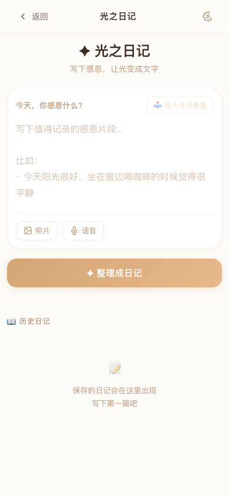
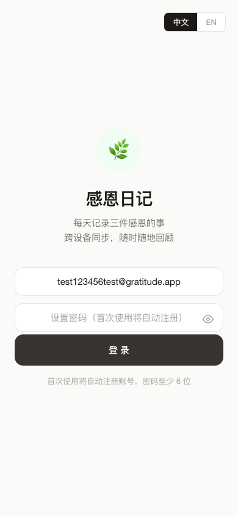

# 🌿 留住这束光 · Gratitude Journal

**不催你写的感恩日记。它只是等光来。**

> *A gratitude app that doesn't guilt you into writing. It just waits for the light.*

[**V1-Diary 体验 →**](https://davidma1973simu.github.io/gratitude-app/v1-diary/diary.html) &nbsp;·&nbsp; [**V2 体验 →**](https://davidma1973simu.github.io/gratitude-app/v2/) &nbsp;·&nbsp; [**V1 原版 →**](https://davidma1973simu.github.io/gratitude-app/v1/)

---

## 为什么做这个

市面上的感恩日记 app 把感恩当作业：连续天数、勋章、推送提醒、"别断了链子！"——漏了一天，比不写还难受。

**感恩不是任务，是一种频率。**

当你停下来注意到一些好的东西——墙上的一束光、朋友的一条消息、一个安静的早晨——你在把自己调到另一个频率。时间久了，雾散了，心稳了，有些东西就变了。不是玄学，就是：注意力在哪里，能量就流向哪里。

这个 app 建立在一个原则上：

> **不 guilt。不补写。今天是新的一天。**

---

## 四个版本，一条路径

### V1-Diary — 光之日记 ⭐ 主推

*当感恩不只是文字，而是一张可以触摸的卡片。*

V1-Diary 是在 V1 基础上生长出的情感日记体验。不只是写三句话——它把你的碎片感受变成一张有温度的卡片。

- **📸 多维度输入** — 文字 + 图片 + 语音，三种方式捕捉今天的感受
- **✨ AI 日记卡片** — 输入碎片感受，AI 帮你整理成一篇有温度的日记，生成 Instagram 风格的精美卡片
- **🎨 卡片导出** — 一键将日记卡片保存为 PNG 图片，分享到社交平台
- **🌈 情绪光谱** — 用点阵可视化你的情绪基调，不是冰冷的数据，是温柔的镜像
- **📝 导入今日感恩** — 从 V1 主页一键导入今天已写的感恩条目，无缝衔接
- **📖 日记历史** — 按日期浏览所有过往日记
- **🔋 AI 设置** — 右上角小图标，输入 DeepSeek API Key 即可启用 AI 功能，无 Key 时优雅降级

<p align="center">
  
  
</p>
<p align="center">✨ 多模态输入 · AI日记卡片 · 一键导出PNG · 情绪光谱</p>

[体验 V1-Diary →](https://davidma1973simu.github.io/gratitude-app/v1-diary/diary.html)

**适合谁**：想要记录更多感受、不满足于三句话、喜欢分享美好卡片的人。

---

### V2 — 光会回来 ⭐ 主推

*你写下的光，会在某一天回到你身上。*

V2 是 Polaroid 拍立得风格的感恩体验。视觉更美，情感更深，但同样安静。

- **📸 Polaroid 卡片** — 你的感恩变成一张拍立得照片卡。随机风景背景，你的文字以光感字体呈现。可以保存、分享。
- **🌌 Reunion 重逢** — 全屏沉浸式回顾一条过去的感恩。不是列表——是一次重逢。
- **🌿 安静鼓励** — 里程碑提示以淡绿色手写体出现：第一次记录、第二次、连续三天、共七次、共二十次。没有勋章，没有庆祝。只是一句低语。
- **✨ 问候语** — *「感谢今天的，照到我身上的光」* — 一句话改变你进入 app 的感觉。
- **💧 水印回声** — 首页淡淡浮现一条过往感恩，隐约如水印。

<p align="center">
  
  
</p>
<p align="center">📸 Polaroid卡片 · 🌌 Reunion重逢 · 🌿 安静鼓励 · ✨ 光感问候</p>

[体验 V2 →](https://davidma1973simu.github.io/gratitude-app/v2/)

**适合谁**：注重视觉美感、喜欢拍立得质感、需要温和的习惯养成人。

---

### V2-Care — AI 悄悄在身后

*你不用知道 AI 在做什么。你只会觉得，这个 app 更懂你了。*

V2-Care 是 V2 的 AI 增强版。**所有 AI 功能对用户完全隐藏**——没有开关面板，没有功能介绍，只有一个右上角的小⚙️图标用于输入 API Key。有 Key，AI 就在；没 Key，安静降级。

四个 AI 能力，各司其职：

| 能力 | 表面看 | 背后做的事 | 价值 |
|------|--------|-----------|------|
| **① 鼓励语个性化** | 里程碑提示文字变了 | AI 读取你最近几天的感恩内容，生成与你具体细节相关的鼓励语 | 不是「你坚持了3天」，而是「三天前你提到妈妈，今天又出现了类似的温度」——真正被看见的感觉 |
| **② Reunion 语义匹配** | 重逢的那条历史记录好像特别搭 | 不再随机取，AI 用关键词重叠度打分，找一条和今天语义最相关的过去记录 | 「你在3个月前也注意到了这个」——时间深处的回响 |
| **③ 给今天的我** | 提交后出现一句安静的洞察 | AI 解读你的感恩片段，给一句有洞察力的回应（不是彩虹屁） | 不打扰，不弹出，就安静地在感谢弹窗里出现一句 |
| **④ 签名词情绪匹配** | 卡片底部签名英文词好像很搭 | 不再随机30词，AI 根据当天情绪基调选词（warm → love，calm → stillness） | 卡片更有灵魂，签名不只是装饰 |

[体验 V2-Care →](https://davidma1973simu.github.io/gratitude-app/v2-care/)

**适合谁**：愿意折腾 API Key 的深度用户、技术社区开发者、想体验 AI 增强感恩的人。

**设计原则**：AI 是幕后工作者，不是台前表演者。用户不需要知道 AI 在做什么——只会觉得这个 app 更懂自己了。

---

### V1 — 安静的房间

*最纯粹的感恩练习，没有多余的东西。*

V1 是一切的开始。简单、安静、可靠。

- 写 1-3 件感恩的事——一句话就够
- 自动保存草稿
- 跨设备同步
- 历史浏览与搜索
- 中英双语
- PWA 离线可用

[体验 V1 →](https://davidma1973simu.github.io/gratitude-app/v1/)

**适合谁**：极简主义者、不需要花哨功能、只想安静记录的人。

---

## 版本对比

| | V1 | V1-Diary | V2 | V2-Care |
|---|---|---|---|---|
| **核心体验** | 写感恩 | AI日记卡片 | Polaroid视觉 | V2+AI增强 |
| **输入方式** | 文字 | 文字+图片+语音 | 文字 | 文字 |
| **视觉风格** | 极简平实 | Instagram卡片风 | 拍立得风 | 拍立得风 |
| **AI 能力** | — | AI日记生成 | — | 4维AI增强 |
| **鼓励系统** | — | — | 5层里程碑 | AI个性化鼓励 |
| **卡片导出** | — | PNG图片 | — | — |
| **历史回顾** | 列表搜索 | 日记历史 | Reunion重逢 | AI语义Reunion |
| **门槛** | 最低 | 低（需API Key启用AI） | 中 | 中高（需API Key） |
| **适合人群** | 极简主义者 | 感性记录者 | 视觉敏感者 | 深度探索者 |

---

## 设计哲学

| | |
|---|---|
| **不 guilt** | 漏了一天？没问题。没有连续天数，没有勋章，没有"你已坚持3天！" |
| **不打扰** | 没有广告，没有分析追踪，没有弹窗。你的数据是你的。 |
| **低语，不喊叫** | 鼓励是淡绿色手写体小字，不是彩色纸屑。app 尊重安静。 |
| **习惯 → 身份** | 不是"你今天写了吗？"，而是"你是一个会注意到光的人。" |
| **AI 是仆人，不是主人** | AI 在幕后工作，用户不需要知道它在做什么。没有 AI 面板，没有功能开关。 |

---

## V3 愿景 — 光的汇聚

> *当感恩不再是记录，而是一种修行。*

V1 教人停下来看见光。V1-Diary 把光变成可以触摸的卡片。V2 让光在未来的某一天回到你身上。V2-Care 让 AI 悄悄帮你看见自己没注意到的光。

**V3 想做的，是把光汇聚起来。**

### 核心命题

感恩的本质不是"记录好事"。感恩是一种**注意力训练**——你练习把注意力从匮乏转向丰盛，从缺失转向已有。持续练习，量变到质变：

- **阳气汇聚** — 每一次感恩都是一束微光。光积累够了，内在的阴翳自然消散。不是道理，是物理。
- **业力消解** — "业力"不是玄学概念，是心理学的认知偏见：你关注什么，就吸引什么。持续关注丰盛，匮乏的引力就减弱。
- **好运与平和** — 不是感恩带来好运，是感恩改变了你感知机会的频率。平和不是没有波动，是有足够的内在空间容纳波动。
- **心性修复** — 碎裂的自我需要被重新整合。每一次"我感谢"的瞬间，都是自我重新缝合的一针。
- **完形** — Gestalt。不是变成更好的自己，是变成完整的自己。光不创造新的东西，光让你看见已有的东西。

### V3 方向探索

| 方向 | 描述 | 为什么 |
|------|------|--------|
| **光的积聚** | 不再是单条记录，而是可视化你积累的"光"——30天的感恩变成一片星空 | 让用户看见自己的内在积累，从"写了一条"变成"我有很多光" |
| **回声地图** | 你的感恩关键词映射成一张内在地图——"家庭""自然""自我"的比例变化 | 看见自己关注重心的迁移，是一种深层自我认知 |
| **光的赠予** | 匿名将一条感恩"送给"另一个正在低谷的人 | 不社交，不互动，只是纯粹的给予——感恩的最高形式 |
| **周期律动** | 根据24节气/月相，推送当天的感恩引导 | 让感恩与自然节律同步，不是 app 推送，是天地提醒 |
| **静默时刻** | 每天一个3分钟的"光的呼吸"——不是冥想app，是感恩app的安静时刻 | 感恩不只是写，也是感受。给感受一个容器 |

### 表达原则

V3 不会用这些词：
- ~~"改变命运"~~ ~~"吸引力法则"~~ ~~"能量场"~~ ~~"高频振动"~~

V3 会用这些词：
- "注意到" "积累" "回响" "频率" "容器" "完整"

**庸俗的反面不是高雅，是诚实。** V3 不承诺任何结果，只提供一种持续练习的可能性。

---

## 技术栈

- **单文件 PWA** — `index.html` 包含全部 HTML/CSS/JS（V1 ~2,000行，V2 ~3,100行，V1-Diary ~1,600行）
- **Supabase**（免费层）— Auth + 存储，原生 `fetch` 调用 REST API（无 SDK，中国可用）
- **Service Worker** — 离线缓存 + 版本管理
- **LocalStorage** 主缓存，Supabase 云同步
- **行级安全** — 每个用户只能访问自己的数据
- **DeepSeek API** — V1-Diary 和 V2-Care 的 AI 能力（用户自备 Key，存 localStorage）
- **html2canvas** — V1-Diary 卡片 PNG 导出
- **零外部依赖** — 不依赖任何 CDN 框架（html2canvas 除外），中国可用

---

## 快速开始

1. 打开上方链接（手机或电脑均可）
2. 输入邮箱 + 设置密码（首次自动注册）
3. 写一件你感恩的事——一句话就够了
4. 安装为 PWA：Android → 安装提示；iOS → Safari 分享 → 添加到主屏幕

**启用 AI 功能（V1-Diary / V2-Care）**：
1. 获取 [DeepSeek API Key](https://platform.deepseek.com/)
2. 点击右上角⚙️图标
3. 粘贴 Key，保存
4. AI 功能自动启用

---

## 自部署

```bash
git clone https://github.com/davidma1973simu/gratitude-app.git
# 用任意静态服务器部署（GitHub Pages, Netlify 等）
# 启用云同步：创建 Supabase 项目，更新 index.html 中的 SB_URL + SB_KEY
```

**Supabase 配置：**
1. 在 [supabase.com](https://supabase.com) 创建项目
2. 运行以下 SQL
3. Authentication → Providers → Email，关闭 "Confirm email"
4. 更新 `index.html` 中的 `SB_URL` 和 `SB_KEY`

```sql
CREATE TABLE entries (
  id UUID DEFAULT gen_random_uuid() PRIMARY KEY,
  user_id UUID REFERENCES auth.users(id) ON DELETE CASCADE NOT NULL,
  date TEXT NOT NULL,
  content1 TEXT, content2 TEXT, content3 TEXT,
  created_at TIMESTAMPTZ DEFAULT now(),
  UNIQUE(user_id, date)
);
ALTER TABLE entries ENABLE ROW LEVEL SECURITY;
CREATE POLICY "Users read own entries" ON entries FOR SELECT USING (auth.uid() = user_id);
CREATE POLICY "Users insert own entries" ON entries FOR INSERT WITH CHECK (auth.uid() = user_id);
CREATE POLICY "Users update own entries" ON entries FOR UPDATE USING (auth.uid() = user_id);
```

---

## 截图

<p align="center">
  
  
  
</p>
<p align="center">
  
  
  
</p>

---

## 路线图

| 版本 | 状态 | 核心 |
|------|------|------|
| **V1** | ✅ 稳定 | 基础感恩练习 — 写、存、回顾 |
| **V1-Diary** | ✅ 稳定 | AI 光之日记 — 多模态输入、AI卡片、PNG导出 |
| **V2** | ✅ 稳定 | 情感深度 — Polaroid卡片、Reunion、安静鼓励 |
| **V2-Care** | 🧪 Beta | V2 + AI四维增强 — 个性化鼓励、语义Reunion、洞察、签名选词 |
| **V3** | 🔮 愿景 | 光的汇聚 — 内在积累可视化、回声地图、光的赠予、周期律动 |

---

## License

MIT — 用它，改它，分享它。只是别加广告。

---

*留住这束光 — Keep this light.*
